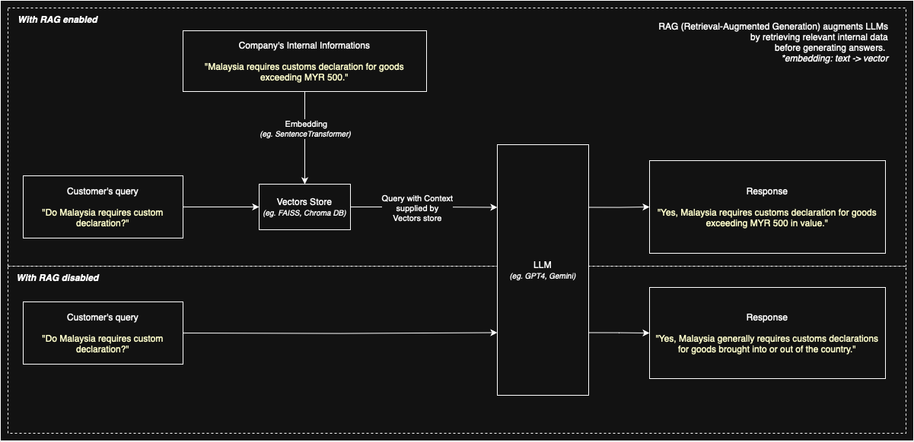

# 🧠 Intelligent Assistance Backend with RAG & LLM Integration

This project showcases a modular backend architecture built with **Python**, **FastAPI**, and **LLM integration** (OpenAI, Gemini, Anthropic). It features optional **RAG (Retrieval-Augmented Generation)** capabilities and pluggable embedding/vector store components using **FAISS** and **Sentence Transformers**.

---

## 🔧 Features

- ✅ FastAPI-based backend for:
    - `/assitance` for LLM call with control to enable/ disable RAG.
    - `/rag` for RAG information management (crud).
- ✅ ABC for all `llm`, `vectorstores` and `rag` so that we can plug new provider.

---

## 📚 What is RAG?

**Retrieval-Augmented Generation (RAG)** enhances LLM responses by retrieving relevant context before generating a reply. It prevents hallucination and ensures answers are grounded in your domain-specific data.



### 🆚 Comparison

#### Without RAG:
```json
{
  "query": "In less than 50 words; Do Malaysia requires custom declaration?",
  "response": "Yes, Malaysia generally requires customs declarations for goods brought into or out of the country...",
  "is_rag_enabled": false,
  "context": null
}
```

#### With RAG:
```json
{
  "query": "Context: Malaysia requires customs declaration for goods exceeding MYR 500. ...\nQuestion: In less than 50 words; Do Malaysia requires custom declaration?",
  "response": "Yes, Malaysia requires customs declaration for goods exceeding MYR 500 in value.",
  "is_rag_enabled": true,
  "context": "Malaysia requires customs declaration for goods exceeding MYR 500. ..."
}
```

Answer with RAG is more **specific** and **informative** by incorporating the provided context about the MYR 500 threshold. It doesn't just say "yes," but adds the crucial condition for when a declaration is needed, making the answer more **helpful**.


### 🌟 Key Benefits of RAG

* **Up-to-date Information:** Access current data beyond the model's training.
* **Reduced Hallucinations:** More factual responses by grounding in retrieved data.
* **Increased Accuracy & Relevance:** Context-aware answers using external knowledge.
* **Cost-Effective:** Leverages existing data; avoids full model retraining.


### 🔍 Main Assistance Endpoint
```json
// QUERY:
POST http://localhost:8000/api/assistance

{
    "is_use_rag": true,
    "query": "In less than 50 words; Do Malaysia requires custom declaration?"
}


// RESPONSE:
{
  "query": "...",
  "response": "...",
  "context": "...",
  "is_rag_enabled": true,
  "provider": "gemini",
  "llm_model": "gemini-2.0-flash",
  "query_time": "...",
  "time_taken_ms": 847.69
}

```

### 📂 RAG Data Management
```json
// QUERY:
POST http://localhost:8000/api/rag/add

{
  "text": "Malaysia requires customs declaration for goods exceeding MYR 500."
}

```

### 🏗️ Architecture Overview
- `LLMProvider` → Abstract base for all LLM services
- `EmbeddingProvider` → Abstract base for vector generation
- `VectorStore` → Abstract base for vector DBs (e.g., FAISS)
- `Factory classes` → Load providers dynamically from .env

All modules are pluggable, allowing future replacement with other services (e.g., Cohere, Pinecone, Chroma).


### 🚀 Quick Start
1. Clone this repo
2. Create .env with LLM provider info
3. Run: `python main.py`


### 🧪 Example .env
```
LLM_PROVIDER=gemini
GEMINI_API_KEY=your_key
GEMINI_MODEL_NAME=gemini-2.0-flash
```

## RAG Use Cases

* **Enhanced Chatbots:** Accurate & context-aware customer/internal support.
* **Knowledge Retrieval:** Quick access to information in documents & databases.
* **Content Generation:** Fact-based articles, reports, and summaries.
* **Personalized Recommendations:** Relevant product suggestions.
* **Specialized Domains:** Healthcare, legal, finance, manufacturing knowledge access.


To-do:
- Text chunking
- gitignore storage
